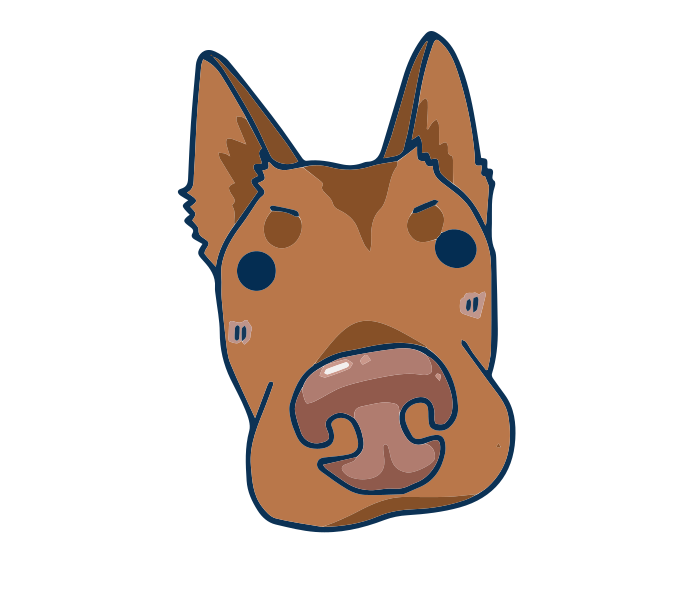
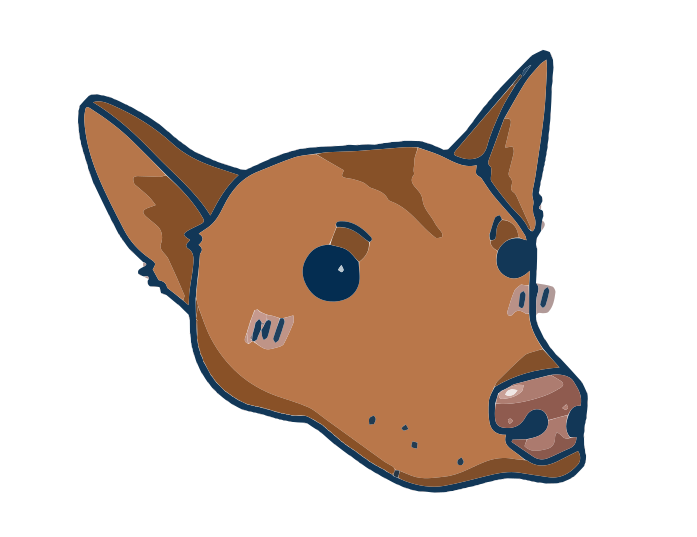

<p align="center">
  
</p>

<h1 align="center">WhisperWoof</h1>

<p align="center">
  <strong>Voice-first personal automation for power users.</strong><br>
  Speak a command. It transcribes, polishes, and routes — all locally on your Mac.
</p>

<p align="center">
  <a href="https://github.com/h3qing/whisperwoof/releases/latest"></a>
  <a href="https://github.com/h3qing/whisperwoof/stargazers"></a>
  <a href="LICENSE"></a>
  <a href="https://github.com/h3qing/whisperwoof/actions"></a>
</p>

<p align="center">
  <a href="#quick-start">Quick Start</a> &middot;
  <a href="#features">Features</a> &middot;
  <a href="#how-it-works">How It Works</a> &middot;
  <a href="https://github.com/h3qing/whisperwoof/releases/latest">Download</a>
</p>

---

<br>

## The Problem

Voice transcription tools turn speech into text — then stop. You still copy-paste into apps, switch windows, route output manually.

The open-source world has two mature, disconnected layers:
- **Voice/STT:** OpenWhispr, Whispering, VoiceInk
- **Workflow automation:** n8n, Activepieces, Huginn

Nobody built the bridge. **WhisperWoof is that bridge.**

<br>

## How It Works

<table>
<tr>
<td width="200" align="center">
<br>
<strong>1. Hold Fn</strong><br>
<sub>Mando's ears perk up.<br>You're recording.</sub>
</td>
<td width="60" align="center">&#10132;</td>
<td width="200" align="center">
<strong>2. Speak</strong><br>
<sub>Say whatever you want.<br>Filler words welcome.</sub>
</td>
<td width="60" align="center">&#10132;</td>
<td width="200" align="center">
<strong>3. Release</strong><br>
<sub>Clean, polished text<br>appears at your cursor.</sub>
</td>
</tr>
</table>

```
Voice ──▶ Local STT (Whisper/Parakeet)
              │
              ▼
         Local LLM Polish (Ollama)
         Removes filler, fixes grammar
              │
              ▼
         Hotkey-driven routing
              │
              ├──▶ Fn         → Paste polished text at cursor
              ├──▶ Fn + T     → Add to todo list
              ├──▶ Fn + N     → Save as Markdown note
              ├──▶ Fn + C     → Add to calendar
              └──▶ All entries saved to searchable history
```

<br>

## Features

<table>
<tr>
<td width="50%" valign="top">

### Core Pipeline
- **Local voice-to-text** — Whisper STT on your machine. No cloud, no latency, no data leaving your laptop.
- **AI text polish** — Ollama removes filler, fixes grammar, adds punctuation. 5 presets or write your own.
- **Hotkey-driven routing** — Different combos send voice to different destinations. Explicit, not magic.

### Capture & History
- **Unified clipboard + voice history** — Everything you say or copy, searchable. Images too.
- **Audio playback** — Tap any entry to replay the original recording.
- **Full-text search** — SQLite FTS5 across all your voice and clipboard entries.

</td>
<td width="50%" valign="top">

### Intelligence
- **Context-aware** — Detects active app. VS Code gets code style, Slack gets casual, Mail gets professional.
- **Voice commands** — "Rewrite this." "Translate to Spanish." "Summarize." 10 editing commands.
- **Cmd+K command bar** — Spotlight-style overlay. Type /todo, /note, /project.

### Smart Clipboard *(new)*
- **Kanban board** — Organize reusable text snippets into boards (Greetings, Work, Code, etc.)
- **Quick paste** — Copy any snippet with one click. Hotkey paste with Cmd+Shift+1-9.
- **Frequency tracking** — See which snippets you use most. Sorted by usage count.
- **Source tracking** — Know if a snippet was typed manually, AI-generated, or captured from voice.

### Privacy & Design
- **Privacy lock** — One toggle blocks ALL cloud access. Ollama-only, zero network.
- **MCP plugins** — Route voice to Todoist, Notion, Slack. Any MCP server works as a plugin.
- **Mando's ears** — The floating indicator has dog ears that perk up when you speak.

</td>
</tr>
</table>

<br>

## Quick Start

```bash
# Clone and run
git clone https://github.com/h3qing/whisperwoof.git
cd whisperwoof
npm install
npm start
```

**Or download the app directly:** [Latest .dmg release (Apple Silicon)](https://github.com/h3qing/whisperwoof/releases/latest)

**Optional** — install Ollama for AI text polishing:
```bash
brew install ollama && ollama pull llama3.2:1b && ollama serve
```

### Requirements

- **macOS** (Apple Silicon recommended)
- **Microphone** (built-in or external)
- **Ollama** (optional) — for local AI text polish. [Install Ollama](https://ollama.com/)

<br>

## Design Principles

| Principle | What it means |
|---|---|
| **Hotkey = intent** | The key combo you press determines where voice goes. Explicit over magic. |
| **Local-first** | Everything runs on your machine. No cloud. No data leaving your device. |
| **Fork, don't reinvent** | Built on OpenWhispr's proven STT engine and Electron shell. |
| **Power users first** | Control, customization, and ownership of your tools. |

<br>

## Tech Stack

| Layer | Technology |
|---|---|
| Runtime | Electron 39 + React 19 + TypeScript + Tailwind CSS v4 |
| STT | OpenAI Whisper / NVIDIA Parakeet (local) |
| LLM Polish | Ollama (local, optional — works without it) |
| Storage | SQLite + Kysely ORM + FTS5 full-text search |
| Plugins | Model Context Protocol (MCP) |

<br>

## Roadmap

- [x] **Phase 0** — Fork + security hardening + test infrastructure
- [x] **Phase 1a** — Core pipeline: StorageProvider, Ollama polish, hotkey routing
- [x] **Phase 1b** — Features: clipboard history, voice history UI, floating indicator, projects
- [x] **Smart Clipboard** — Kanban snippet boards, IPC bridge, frequency tracking
- [ ] **Phase 2** — MCP plugin system (Todoist, Notion, Slack, Calendar)
- [ ] **Phase 3** — Polish, onboarding wizard, public release

<br>

## Credits

WhisperWoof is a fork of **[OpenWhispr](https://github.com/OpenWhispr/openwhispr)** — we're grateful to the OpenWhispr team for building such a solid foundation.

Also built on: [OpenAI Whisper](https://github.com/openai/whisper) · [NVIDIA Parakeet](https://huggingface.co/nvidia/parakeet-tdt-0.6b-v2) · [Ollama](https://ollama.com/) · [Model Context Protocol](https://modelcontextprotocol.io/)

<br>

## Contributing

WhisperWoof is in early development. Contributions, feedback, and ideas are welcome — please open an issue to discuss before submitting a PR.

## License

MIT — see [LICENSE](LICENSE) for details.

---

<p align="center">
  <br>
  <sub>Named after Mando, who always listens.</sub><br>
  <sub>Built with care by <a href="https://github.com/h3qing">Heqing</a>.</sub>
</p>
